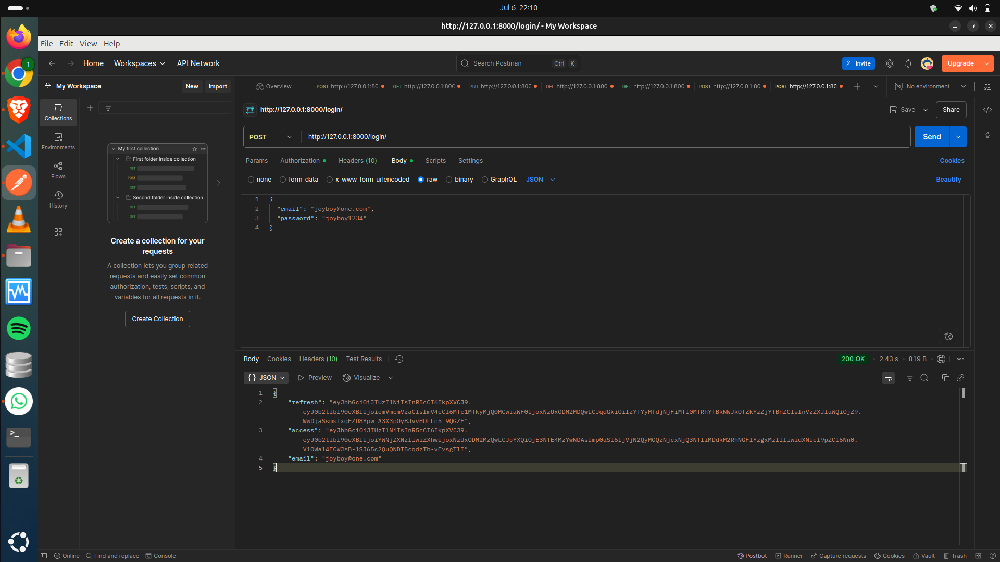

# Book Library API

A RESTful API for managing books and categories. Users can register, log in, and perform CRUD operations on books and categories. Each book can be assigned to a category.

---

## Features

- User registration and JWT login (authentication required for most actions)
- CRUD operations for books and categories
- Assign books to categories

---
## Setup Instructions

1. **Clone the repository**
2. **Create a virtual environment**
   ```bash
   python -m venv myenv
   ```
3. **Activate the virtual environment**
   ```bash
   source myenv/bin/activate
   ```
4. **Install dependencies**
   ```bash
   pip install -r requirements.txt
   ```

---

## Database Setup

1. **Apply migrations** to set up the database schema:
   ```bash
   python manage.py makemigrations
   python manage.py migrate
   ```
2. **Create a superuser** (optional, for admin access):
   ```bash
   python manage.py createsuperuser
   ```

> **Note:**  
> The database file (`db.sqlite3`) and migration files are not included in the repository.  
> You must run the above commands to initialize your database.

---

## Running the Server

Start the development server:
```bash
python manage.py runserver
```

## Authentication

> **Note:** Register and log in to obtain a JWT token. Only authenticated users can perform most actions.

---

## API Endpoints

### Authentication

- **Register:**  
  `POST /register/`
- **Login (obtain JWT):**  
  `POST /login/`  
  _Returns access and refresh tokens. Use the access token as a Bearer token for authenticated requests._

### Categories

- **List categories:**  
  `GET /api/create_category/`
- **Create category:**  
  `POST /api/create_category/`
- **Update category:**  
  `PUT /api/update/<id>/category/`
- **Delete category:**  
  `DELETE /api/delete/<id>/category/`

### Books

- **List books:**  
  `GET /api/create_book/`
- **Create book:**  
  `POST /api/create_book/`
- **Update book:**  
  `PUT /api/update/<id>/book/`
- **Delete book:**  
  `DELETE /api/delete/<id>/book/`

---

## Usage Notes

- Use [Postman](https://www.postman.com/) or a similar tool to test endpoints.
- When creating a book, the `posted_by` field is set automatically to the authenticated user.
- After logging in, copy the `access` token and use it as a Bearer token in the Authorization header for protected endpoints.

---

## Example Workflows

### Registering an Account


### Logging In



### Using the Access Token


### Creating a Book


### Updating a Book


---

**Open source project for learning purposes.**